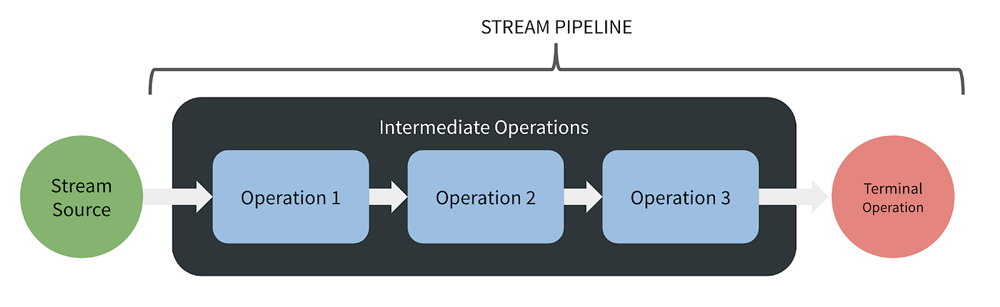

# 5. Programação Reativa

## O que é Programação Reativa?

A programação reativa é um paradigma de programação focado no processamento de **fluxos de dados assíncronos** e na **propagação automática de mudanças de estado**.

Vamos decompor essa definição nos seus termos complicados.

### **Fluxo de dados assícronos**

<figure><figcaption>
Fluxo de dados assíncronos
</figcaption></figure>

Os fluxos de dados (em inglês, "streams") são sequências de eventos que acontecem ao longo do tempo e que são transmitidos de forma assíncrona (sem a espera de uma resposta imediata do receptor). Já lidamos com eventos em outras formas: como cliques de usuários, respostas a chamadas de APIs RESTful, mudanças em campos de formulários.

### Propagação automática de mudanças de estados

A propagação automática de mudanças de estados, significa que, quando um valor muda em algum lugar do sistema, todas as pates que dependem desse valor são automáticamente notificadas e atualizadas, sem que você precise fazer isso manualmente.

Um cenário reativo bem conhecido, é o uso em planilhas. Imagina uma planilha do Excel. Quando mudamos algum valor de alguma célula, digamos B1, todas as outras células que utilizam, diretamente ou indiretamente, B1 são atualizaas automaticamente. Ou seja, as mudanças se "propagam" automaticamente.

<figure><figcaption></figcaption></figure>

&#x20;Em programação reativa, temos um comportamento semelhante, podemos estabelecer relações entre dados (o **estado** da nossa aplicação) e quando ocorrem mudanças nesse **estado**, todos os **interessados (observadores)** serão notificados e podem reagir de acordo.

## Como a programação reativa aparece no **React?**

> "É como o paradoxo do ovo e da galinha, mas com componentes: O React nasceu para reagir à reatividade, que por sua vez reagiu ao React reagindo, criando mais reatividade. Reativo, logo existo!" (Pensamento Intrusivos do Professor).

Quando o Facebook (atual Meta) criou o React em 2013, eles buscavam um _framework_ que permitisse ao projeto do Facebook App de reagir às mudanças de dados de forma mais automática e eficiente, permitindo que o App fosse mais interativo. O cerne da ideia era que a UI (Interface do Usuário) pudesse "reagir (em inglês, _React_)" às mudanças no **estado da aplicação.**

### **Como o React "Reage"?**

**Mudanças de Estado**: Quando você chama `setState` ou atualiza um estado com hooks, o React automaticamente re-renderiza os componentes afetados.

**Propagação de Props**: Quando um componente pai muda, essas mudanças se propagam automaticamente para os componentes filhos através das props.

**Virtual DOM**: O React "reage" comparando o estado atual com o anterior (diffing) e atualiza apenas o que realmente mudou no DOM.
