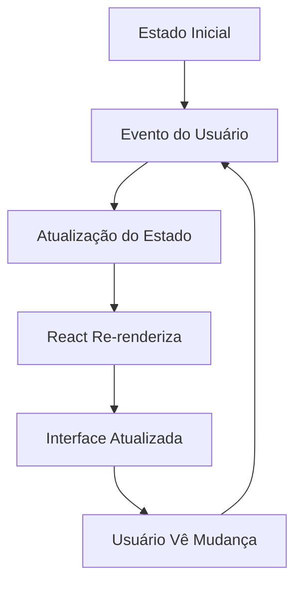
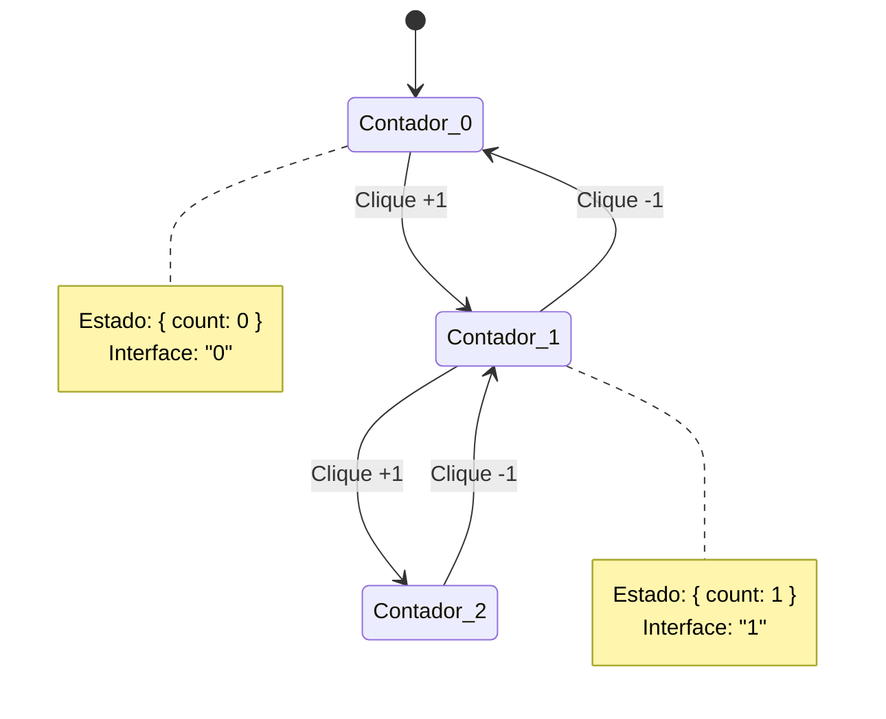
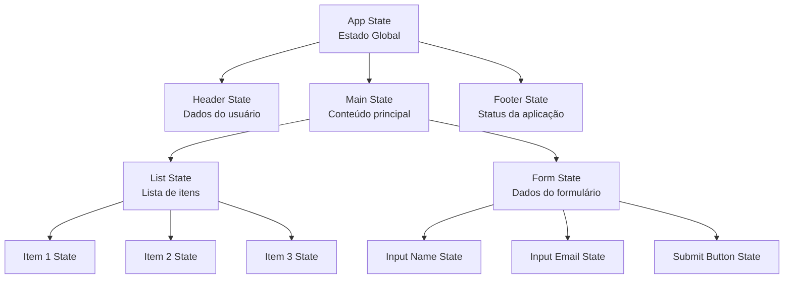
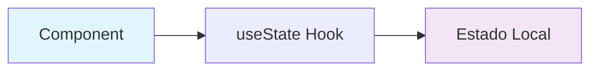
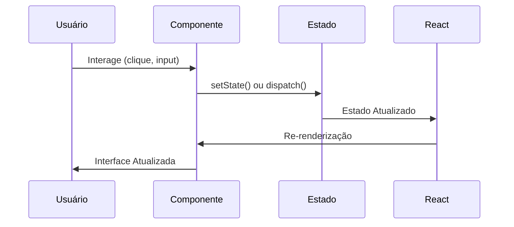
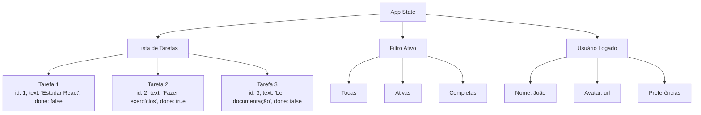
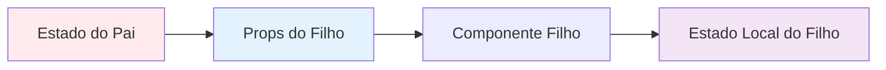

# 6. Estado de uma aplicação

## Estado da Aplicação em React/React Native

### O que é Estado da Aplicação?

O **estado da aplicação** (application state) é um conceito fundamental no desenvolvimento React/React Native que se refere a **todos os dados que determinam como sua aplicação se comporta e aparece em um determinado momento**.

Pense no estado como uma "fotografia" de todas as informações relevantes da sua aplicação naquele instante.

### Componentes do Estado

#### 1. Dados Visíveis ao Usuário

* Conteúdo de formulários que o usuário está preenchendo
* Lista de itens exibidos na tela
* Informações do usuário logado
* Preferências de configuração

#### 2. Estados de Interface

* Qual tela/componente está sendo exibido
* Se um modal está aberto ou fechado
* Se um botão está carregando ou não
* Se dados estão sendo buscados do servidor

#### 3. Dados Temporários

* Resultados de uma busca
* Items no carrinho de compras
* Notificações pendentes

### Fluxo de Estado no React



### Exemplo Prático: Contador



### Hierarquia de Estado



### Tipos de Estado Local




```jsx
// Estado elevado para o pai
function App() {
  const [count, setCount] = useState(0);
  
  return (
    <div>
      <Counter count={count} />
      <Button onClick={() => setCount(count + 1)} />
    </div>
  );
}
```

### Ciclo de Vida do Estado



### Exemplo: Aplicação de Lista de Tarefas



### Princípios Importantes

#### 1. **Reatividade**

O React "reage" automaticamente às mudanças de estado, atualizando a interface.

#### 2. **Imutabilidade**

O estado deve ser tratado como imutável - sempre criar um novo estado ao invés de modificar o existente.

#### 3. **Single Source of Truth**

Cada dado deve ter uma única fonte de verdade no estado da aplicação.

#### 4. **Fluxo Unidirecional**

Os dados fluem em uma direção: Estado → Interface → Ações → Novo Estado

### Estado vs Props



* **Estado**: Dados que o componente controla e pode modificar
* **Props**: Dados que vêm de componentes pais (somente leitura)

### Conclusão

O estado da aplicação é o coração de qualquer aplicação React/React Native. Entender como gerenciá-lo eficientemente é fundamental para criar aplicações responsivas, previsíveis e fáceis de manter.

A regra de ouro é: **quando o estado muda, a interface automaticamente reflete essa mudança**.
