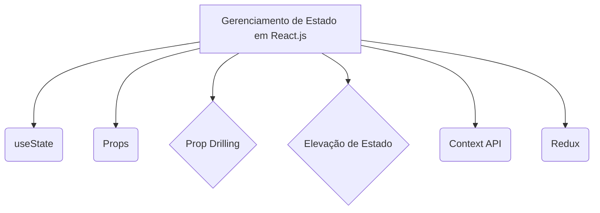
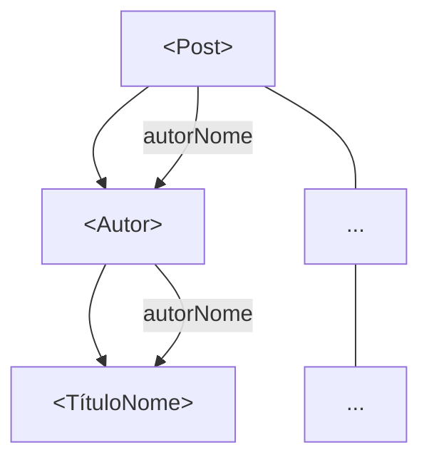

# 6. Reatividade no React

## Manipulação do estado


### Guia



***

### marp: true theme: default paginate: true backgroundColor: #ffffff color: #333333

## Conceitos Fundamentais do React

**Gerenciamento de Estado e Props**

***

### Props

**Propriedades que passamos para componentes React**

#### O que são Props?



* São argumentos passados para componentes React
* Permitem que componentes sejam reutilizáveis e dinâmicos
* São **imutáveis** dentro do componente que as recebe
* Fluxo unidirecional: de pai para filho

#### Exemplo Prático

```jsx
// Componente pai
<Post autorNome="Gurguri"/>

// Componente filho
function Post({ autorNome }) {
  return <Autor nome={autorNome}></button>;
}
```

***

### Prop Drilling

**O problema de passar props através de múltiplos níveis**

#### O que é Prop Drilling?

* Passar props através de vários componentes intermediários
* Componentes intermediários não usam as props, apenas as repassam
* Torna o código difícil de manter e entender

#### Exemplo do Problema

```jsx
App → Header → Navigation → UserMenu → UserName
     (user)    (user)      (user)     (user)
```

#### Sinais de Prop Drilling

* Props passadas através de 3+ níveis
* Componentes que só repassam props
* Dificuldade para rastrear origem dos dados

***

### Elevação de Estado

**Movendo estado para o componente pai comum**

#### Quando Elevar Estado?

* Quando múltiplos componentes precisam do mesmo estado
* Para sincronizar componentes irmãos
* Quando estado local não é suficiente

#### Exemplo Prático

```jsx
// Estado elevado para o pai
function App() {
  const [count, setCount] = useState(0);
  
  return (
    <div>
      <Counter count={count} />
      <Button onClick={() => setCount(count + 1)} />
    </div>
  );
}
```

#### Princípio

**O estado deve viver no ancestral comum mais próximo**

### Efeitos Colaterais

**Operações que afetam o mundo externo ao componente**

#### O que são Efeitos Colaterais?

* Operações que interagem com sistemas externos ao React
* Não são relacionadas diretamente à renderização
* Podem causar mudanças observáveis fora do componente
* Precisam ser gerenciados adequadamente

#### Exemplos Comuns

* Requisições HTTP (fetch, axios)
* Manipulação direta do DOM
* Timers (setTimeout, setInterval)
* Subscrições (WebSocket, event listeners)
* Logging e analytics
* Limpeza de recursos

***

### Efeitos Colaterais - Problemas

#### Por que são Problemáticos?

* Componentes devem ser **funções puras** na renderização
* Efeitos podem causar comportamentos inesperados
* Difícil de testar e debugar
* Podem causar memory leaks

#### Exemplo Problemático

```jsx
// ❌ Efeito colateral na renderização
function BadComponent() {
  // Executa a cada render!
  fetch('/api/data').then(setData);
  
  return <div>...</div>;
}
```

#### Onde NÃO colocar efeitos

* Diretamente no corpo do componente
* Em event handlers sem necessidade
* Em loops de renderização

***

### useEffect

**Hook para gerenciar efeitos colaterais de forma segura**

#### O que é useEffect?

* Hook nativo do React para efeitos colaterais
* Executa após a renderização (não bloqueia)
* Permite controlar **quando** e **como** executar efeitos
* Substitui os lifecycle methods de class components

#### Sintaxe Básica

```jsx
import { useEffect } from 'react';

function Component() {
  useEffect(() => {
    // Efeito colateral aqui
    console.log('Componente renderizou');
  });
  
  return <div>...</div>;
}
```

***

### useEffect - Array de Dependências

#### Controlando Execução

```jsx
// Executa após toda renderização
useEffect(() => {
  console.log('Sempre executa');
});

// Executa apenas uma vez (componentDidMount)
useEffect(() => {
  console.log('Executa uma vez');
}, []);

// Executa quando 'count' muda
useEffect(() => {
  console.log('Count mudou:', count);
}, [count]);

// Múltiplas dependências
useEffect(() => {
  console.log('User ou posts mudaram');
}, [user, posts]);
```

***

### useEffect - Cleanup Function

#### Limpando Recursos

```jsx
useEffect(() => {
  // Setup
  const timer = setInterval(() => {
    console.log('Timer executando');
  }, 1000);
  
  // Cleanup (componentWillUnmount)
  return () => {
    clearInterval(timer);
    console.log('Timer limpo');
  };
}, []);
```

#### Quando usar Cleanup?

* Timers e intervalos
* Event listeners
* Subscriptions (WebSocket, etc.)
* Cancelar requisições HTTP
* Liberar recursos

***

### useEffect - Casos de Uso Comuns

#### 1. Requisições HTTP

```jsx
useEffect(() => {
  const fetchData = async () => {
    try {
      const response = await fetch('/api/users');
      const users = await response.json();
      setUsers(users);
    } catch (error) {
      setError(error.message);
    }
  };
  
  fetchData();
}, []);
```

#### 2. Event Listeners

```jsx
useEffect(() => {
  const handleResize = () => {
    setWindowWidth(window.innerWidth);
  };
  
  window.addEventListener('resize', handleResize);
  
  return () => {
    window.removeEventListener('resize', handleResize);
  };
}, []);
```

***

### useEffect - Boas Práticas

#### ✅ Faça

* Use array de dependências correto
* Sempre limpe recursos na cleanup function
* Separe efeitos por responsabilidade
* Use ESLint plugin para React Hooks

#### ❌ Evite

* Omitir dependências necessárias
* Colocar objetos/arrays nas dependências sem useMemo
* Efeitos muito complexos em um único useEffect
* Efeitos infinitos (dependência que sempre muda)

#### Exemplo de Efeito Infinito

```jsx
// ❌ Problema: count sempre muda
useEffect(() => {
  setCount(count + 1);
}, [count]);

// ✅ Solução: função de atualização
useEffect(() => {
  setCount(prev => prev + 1);
}, []);
```

***

***

### Context API

**Solução nativa do React para compartilhar estado**

#### O que é Context API?

* Permite compartilhar dados entre componentes sem prop drilling
* Cria um "túnel" direto entre provedor e consumidor
* Nativa do React, sem bibliotecas externas

#### Estrutura Básica

```jsx
// 1. Criar Context
const UserContext = createContext();

// 2. Prover dados
<UserContext.Provider value={userData}>
  <App />
</UserContext.Provider>

// 3. Consumir dados
const userData = useContext(UserContext);
```

***

### Context API - Quando Usar

#### ✅ Bom para:

* Dados globais (usuário logado, tema, idioma)
* Configurações da aplicação
* Estado compartilhado por muitos componentes

#### ❌ Evitar para:

* Estado local simples
* Dados que mudam frequentemente
* Performance crítica (re-renderiza todos os consumidores)

#### Exemplo Real

```jsx
const ThemeContext = createContext();

function App() {
  const [theme, setTheme] = useState('light');
  
  return (
    <ThemeContext.Provider value={{ theme, setTheme }}>
      <Header />
      <Main />
      <Footer />
    </ThemeContext.Provider>
  );
}
```

***

### Redux

**Biblioteca para gerenciamento de estado global**

#### O que é Redux?

* Biblioteca externa para gerenciar estado da aplicação
* Estado centralizado em uma **store**
* Fluxo de dados previsível e unidirecional
* Baseado no padrão Flux

#### Princípios Fundamentais

1. **Single Source of Truth**: Um estado global
2. **State é Read-Only**: Mudanças apenas via actions
3. **Mudanças via Pure Functions**: Reducers determinísticos

***

### Redux - Conceitos Principais

#### Store

```jsx
const store = createStore(reducer);
```

#### Actions

```jsx
const incrementAction = { type: 'INCREMENT', payload: 1 };
```

#### Reducers

```jsx
function counterReducer(state = 0, action) {
  switch (action.type) {
    case 'INCREMENT':
      return state + action.payload;
    default:
      return state;
  }
}
```

#### Dispatch

```jsx
store.dispatch(incrementAction);
```

***

### Redux vs Context API

| Aspecto                  | Context API               | Redux              |
| ------------------------ | ------------------------- | ------------------ |
| **Complexidade**         | Simples                   | Mais complexo      |
| **Performance**          | Re-renderiza consumidores | Otimizada          |
| **DevTools**             | Limitadas                 | Redux DevTools     |
| **Middleware**           | Não tem                   | Suporte nativo     |
| **Tamanho**              | Nativo do React           | Biblioteca externa |
| **Curva de Aprendizado** | Baixa                     | Média/Alta         |

***

### Quando Usar Cada Abordagem?

#### Props Simples

* Estado local
* Comunicação pai-filho direta
* Componentes pequenos

#### Context API

* Estado global simples
* Dados de configuração
* Evitar prop drilling moderado

#### Redux

* Aplicações complexas
* Estado global complexo
* Necessidade de debugging avançado
* Time effects (middleware)

***

### Resumo

#### Evolução Natural

```
Props → Prop Drilling → Elevação → Context → Redux
```

#### Escolha a Ferramenta Certa

* **Comece simples**: Props e estado local
* **Evolua gradualmente**: Context quando necessário
* **Redux para complexidade**: Aplicações grandes

#### Lembre-se

> "A melhor ferramenta é a mais simples que resolve seu problema"

***

## Obrigado!

**Dúvidas sobre gerenciamento de estado em React?**

