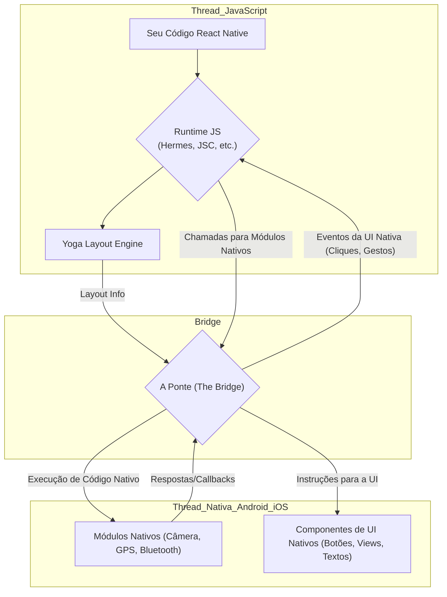

# Arquitetura - Internals

```mermaid
flowchart TD
    subgraph Thread_JavaScript
        A[Seu Código React Native] --> B{"Runtime JS<br/>(Hermes, JSC, etc.)"}
        B --> C[Yoga Layout Engine]
    end
    subgraph Bridge
        D{"A Ponte (The Bridge)"}
        C -- "Layout Info" --> D
        B -- "Chamadas para Módulos Nativos" --> D
        D -- "Eventos da UI Nativa (Cliques, Gestos)" --> B
    end
    subgraph Thread_Nativa_Android_iOS
        E["Módulos Nativos (Câmera, GPS, Bluetooth)"]
        F["Componentes de UI Nativos (Botões, Views, Textos)"]
        D -- "Instruções para a UI" --> F
        D -- "Execução de Código Nativo" --> E
        E -- "Respostas/Callbacks" --> D
    end
```
